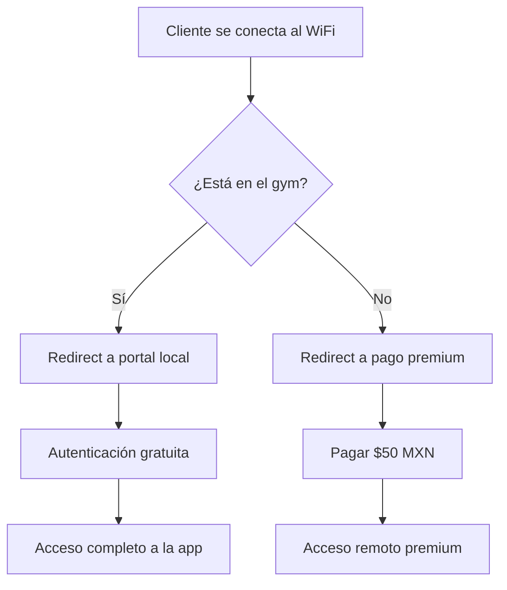

# 🚀 PLAN ESTRATÉGICO ENTRENATECH - MODELO DE NEGOCIO POR CAPAS

## 📋 RESUMEN EJECUTIVO

**EntrenaTech** se transformará en una plataforma SaaS multi-capas que genera ingresos mediante dos flujos principales:

1. **B2B** - Gimnasios pagan $2,500-$3,000 MXN mensuales por el sistema completo
2. **B2C** - Clientes pagan $50 MXN mensuales por acceso fuera del gym

---

## 🎯 ARQUITECTURA INTEGRADA

### **Ecosistema Web Actual (Funcional)**
```
https://entrenapp-2025.web.app/
├── /admin     → SuperAdmin Dashboard
├── /gym       → Dashboard para dueños de gimnasios
├── /member    → PWA Premium para miembros
└── /login     → Autenticación centralizada
```

### **App Flutter (Estratégica)**
```
App EntrenaTech Native
├── Acceso GRATIS dentro del gym (WiFi Mikrotik)
├── Acceso PAGO ($50 MXN) fuera del gym
├── Mismas features que PWA /member
└── Integración con ecosistema web
```

---

## 💰 MODELO DE MONETIZACIÓN

### **Capa 1: B2B - Gimnasios**
**Costo**: $2,500 - $3,000 MXN/mes
**Incluye**:
- ✅ Dashboard admin completo (/gym)
- ✅ Gestión de miembros y entrenadores
- ✅ Analytics con IA predictiva
- ✅ Generador de rutinas IA
- ✅ Sistema de nutrición
- ✅ **App Flutter para sus clientes**
- ✅ **Configuración WiFi Mikrotik**
- ✅ **Portal cautivo personalizado**
- ✅ Soporte técnico prioritario

### **Capa 2: B2C - Clientes Individuales**
**Costo**: $50 MXN/mes
**Modelo similar a Google/YouTube**:
- ✅ **GRATIS dentro del gym** (conectado al WiFi)
- ✅ **PAGO fuera del gym** (datos móviles)
- ✅ Mismas features premium que PWA
- ✅ Gamificación completa
- ✅ Chat IA personal
- ✅ Reproductores de música
- ✅ Videos de ejercicios
- ✅ Seguimiento de progreso

### **Flujo de Ingresos Proyectado**
```
Gimnasio con 100 miembros:
- Ingreso B2B: $2,500 MXN/mes
- 50 miembros pagan app: 50 × $50 = $2,500 MXN/mes
- TOTAL por gimnasio: $5,000 MXN/mes

10 gimnasios = $50,000 MXN/mes
100 gimnasios = $500,000 MXN/mes 🚀
```

---

## 📶 INTEGRACIÓN MIKROTIK WIFI

### **Sistema de Portal Cautivo Inteligente**


### **Configuración Técnica**
1. **Router Mikrotik** con portal cautivo personalizado
2. **Detección automática** de ubicación (IP del gym)
3. **Autenticación local** para miembros del gym
4. **Redirect a pago** para acceso externo
5. **Sincronización** con dashboard del gym

---

## 🏗️ ARQUITECTURA TÉCNICA

### **Backend Centralizado**
```typescript
// API Gateway central
https://api.entrenatech.com/
├── /auth        - Autenticación unificada
├── /gyms        - Gestión de gimnasios
├── /members     - Gestión de miembros
├── /wifi        - Portal WiFi Mikrotik
├── /payments    - Procesamiento de pagos
├── /ai          - Servicios de IA
└── /sync        - Sincronización Web↔Flutter
```

### **Base de Datos Unificada**
- **Usuarios**: Perfiles compartidos Web↔Flutter
- **Gimnasios**: Configuración y miembros
- **Pagos**: Suscripciones B2B y B2C
- **Progreso**: Datos sincronizados multi-plataforma
- **Analytics**: Métricas consolidadas

---

## 📱 APP FLUTTER ESTRATÉGICA

### **Características Premium (Heredadas del PWA)**
1. **Gamificación Completa**
   - Niveles, XP, logros
   - Leaderboard semanal/mensual
   - Desafíos y recompensas
   - Racha de fuego (streaks)

2. **Chat IA Personal**
   - Asistente fitness 24/7
   - Consejos personalizados
   - Motivación diaria
   - Responde preguntas sobre rutinas

3. **Reproductores de Música**
   - Spotify Web SDK
   - Apple Music
   - YouTube Music
   - Playlists de entrenamiento

4. **Videos de Ejercicios**
   - Multi-ángulo (frontal, lateral, superior)
   - Slow-motion para técnica
   - Tips de forma animados
   - Loop mode

5. **Seguimiento Visual**
   - Progreso con gráficos
   - Fotos de transformación
   - Medidas corporales
   - PRs (Personal Records)

### **Diferenciador Clave: WiFi Integration**
```dart
// WiFi Detection Service
class WiFiService {
  Future<bool> isGymNetwork() async {
    // Detecta si está conectado a WiFi del gym
    final wifiInfo = await Connectivity().wifiName;
    return wifiInfo.contains('GymName_');
  }

  Future<AccessMode> getAccessMode() async {
    final inGym = await isGymNetwork();
    return inGym ? AccessMode.free : AccessMode.premium;
  }
}
```

---

## 🔄 FLUJO DE USUARIO

### **Experiencia dentro del Gym**
1. **Cliente descarga app** (Gratis desde App Store/Play Store)
2. **Se conecta al WiFi del gym**
3. **App detecta red automáticamente**
4. **Acceso gratuito** a todas las features
5. **Entrena con todas las herramientas premium**

### **Experiencia fuera del Gym**
1. **Abre app fuera del WiFi**
2. **Detecta ubicación externa**
3. **Muestra pantalla de upgrade**
4. **Paga $50 MXN/mes** (Stripe/MercadoPago)
5. **Acceso completo** desde cualquier lugar

### **Gestor del Gym**
1. **Contrata servicio** $2,500-$3,000 MXN/mes
2. **Configura WiFi Mikrotik** con portal personalizado
3. **Da acceso a sus miembros**
4. **Monitorea usage** en dashboard
5. **Recibe reportes** de engagement

---

## 🛠️ IMPLEMENTACIÓN TÉCNICA

### **Fase 1: Integración Web (2 semanas)**
```bash
# 1. Unificar autenticación entre todas las web apps
npm run build:all
# Deploy a ecosistema unificado
firebase deploy

# 2. Crear API Gateway central
apps/backend/api/
├── auth/
├── gyms/
├── members/
├── wifi/
└── payments/
```

### **Fase 2: App Flutter (4 semanas)**
```bash
# 1. Migrar features del PWA a Flutter
entrenatech_flutter_app/lib/
├── features/
│   ├── gamification/     # Heredado del PWA
│   ├── ai_chat/          # Heredado del PWA
│   ├── music_players/    # Heredado del PWA
│   ├── exercise_videos/  # Heredado del PWA
│   └── progress_tracking/ # Heredado del PWA
│
├── core/
│   ├── wifi_detection/   # NUEVO - Detección de red
│   ├── payment_service/  # NUEVO - Pagos B2C
│   └── sync_service/     # NUEVO - Sincronización
```

### **Fase 3: Integración Mikrotik (2 semanas)**
```bash
# 1. Configurar portal cautivo
router mikrotik setup
├── captive portal redirect
├── local authentication
├── gym network detection
└── API integration

# 2. Sistema de pagos
payment integration
├── Stripe (internacional)
├── MercadoPago (Latinoamérica)
├── Recurring subscriptions
└── Webhook handling
```

---

## 📊 MÉTRAS DE ÉXITO

### **KPIs del Modelo de Negocio**
1. **Adopción de Gimnasios**: 10 gimnasios en 3 meses
2. **Conversión B2C**: 30% de miembros pagan app
3. **Retención**: 80% mensual en gimnasios
4. **Engagement**: 4+ días/semana de uso
5. **Ingresos**: $50,000 MXN/mes en 6 meses

### **Métricas Técnicas**
1. **Performance**: <2s load time
2. **Uptime**: 99.9%
3. **Sincronización**: Real-time Web↔Flutter
4. **WiFi Detection**: <5s
5. **Payment Processing**: <30s

---

## 🎯 ESTRATEGIA DE GO-TO-MARKET

### **Fase 1: Pilot (2 meses)**
- **3 gimnasios seleccionados** como beta testers
- **Costo especial**: $1,000 MXN/mes durante pilot
- **Feedback continuo** y mejora iterativa
- **Case studies** y testimonials

### **Fase 2: Launch (3-6 meses)**
- **Lanzamiento oficial** en Ciudad de México
- **Marketing digital** dirigido a dueños de gimnasios
- **Equipo de ventas** consultivo
- **Meta**: 20 gimnasios nuevos

### **Fase 3: Scale (6-12 meses)**
- **Expansión nacional** (Guadalajara, Monterrey)
- **Partnerships** con fabricantes de equipos
- **Integración** con wearables (Apple Watch, Fitbit)
- **Meta**: 100 gimnasios

---

## 💡 VENTAJA COMPETITIVA

### **Propuesta Única de Valor**
1. **Modelo Híbrido Único**: Gratis en gym, pago fuera
2. **Integración WiFi Real**: Nadie ofrece esto en México
3. **Calidad Premium**: Features de apps de $500 MXN a $50 MXN
4. **Todo en Uno**: Dashboard + App + WiFi + IA
5. **Recurrente**: Ingresos predecibles B2B + B2C

### **Diferenciadores Clave**
- **No requiere instalación compleja** (WiFi Mikrotik estándar)
- **Valor agregado inmediato** para gimnasios
- **Experiencia superior** para clientes finales
- **Precios accesibles** con features premium
- **Escalable** a nivel nacional

---

## 🚀 PRÓXIMOS PASOS INMEDIATOS

### **Semana 1-2: Planificación**
- [ ] Reunión con equipo técnico
- [ ] Definición de arquitectura final
- [ ] Setup de repositorios y pipelines
- [ ] Investigación de requisitos Mikrotik

### **Semana 3-4: Desarrollo Web**
- [ ] Unificar autenticación web apps
- [ ] Crear API Gateway central
- [ ] Integrar pagos B2B
- [ ] Testing integración

### **Semana 5-8: Desarrollo Flutter**
- [ ] Migrar features del PWA
- [ ] Implementar detección WiFi
- [ ] Integrar pagos B2C ($50 MXN)
- [ ] Sincronización con backend

### **Semana 9-10: Integración Mikrotik**
- [ ] Configuración portal cautivo
- [ ] Testing en ambiente real
- [ ] Documentación técnica
- [ ] Pilot con gym beta

### **Semana 11-12: Launch**
- [ ] Deploy a producción
- [ ] Onboarding primer gym
- [ ] Monitoreo y soporte
- [ ] Recolección de feedback

---

## 📈 PROYECCIONES FINANCIERAS

### **Year 1 (Conservador)**
- **Gimnasios**: 20 clientes B2B
- **Miembros pagando**: 300 clientes B2C
- **Ingresos B2B**: 20 × $2,500 = $50,000 MXN/mes
- **Ingresos B2C**: 300 × $50 = $15,000 MXN/mes
- **Total**: $65,000 MXN/mes = $780,000 MXN/año

### **Year 2 (Agresivo)**
- **Gimnasios**: 100 clientes B2B
- **Miembros pagando**: 2,000 clientes B2C
- **Ingresos B2B**: 100 × $2,500 = $250,000 MXN/mes
- **Ingresos B2C**: 2,000 × $50 = $100,000 MXN/mes
- **Total**: $350,000 MXN/mes = $4,200,000 MXN/año

### **Year 3 (Liderazgo)**
- **Gimnasios**: 500 clientes B2B
- **Miembros pagando**: 10,000 clientes B2C
- **Ingresos B2B**: 500 × $2,500 = $1,250,000 MXN/mes
- **Ingresos B2C**: 10,000 × $50 = $500,000 MXN/mes
- **Total**: $1,750,000 MXN/mes = $21,000,000 MXN/año 🦄

---

## 🏆 CONCLUSIÓN

**EntrenaTech** tiene el potencial de convertirse en el líder del mercado fitness technology en México mediante:

1. **Modelo innovador** de acceso por ubicación
2. **Integración tecnológica** superior a la competencia
3. **Estrategia de precios** accesible con valor premium
4. **Escalabilidad** demostrada en la arquitectura
5. **Oportunidad de mercado** desatendida

El proyecto está **listo para ejecución inmediata** con el equipo y la tecnología existente, posicionándose para capturar una parte significativa del mercado fitness mexicano.

**El momento es AHORA.** 🚀